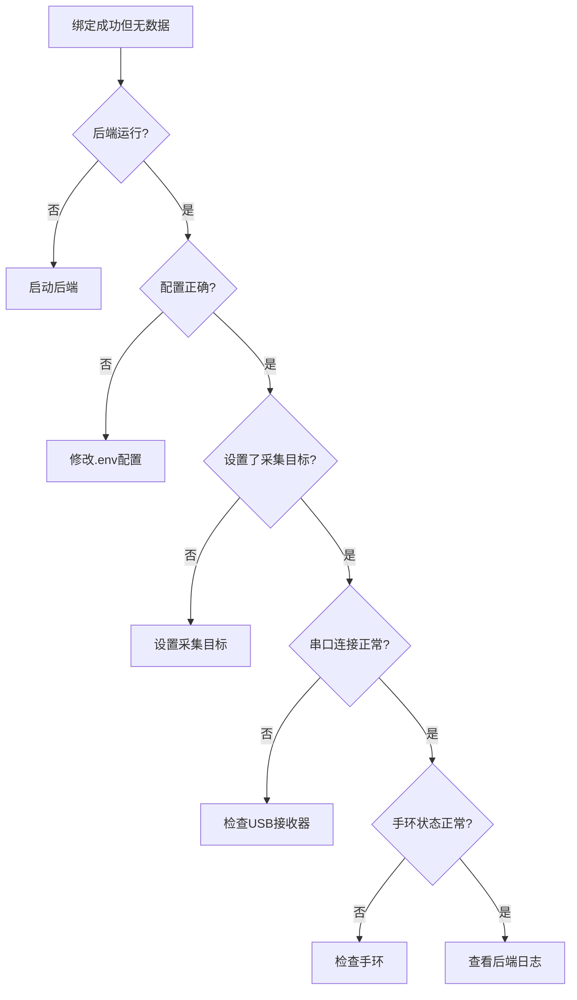

# 绑定后收不到数据包问题解决方案

## 问题现象

✅ 设备绑定成功  
❌ 显示"已绑定，等待首个数据包进入"  
❌ 心率、体温、血氧等数据都是空的  

## 根本原因

系统使用**单目标串口采集模式**，需要明确指定采集哪个手环的数据。

### 工作原理

```
串口接收器 → 后端串口服务 → 当前目标MAC → 数据采集 → 数据库 → 手机APP
                              ↑
                         必须设置！
```

**关键点**：
- 系统同时只能采集**一个手环**的数据
- 必须设置`active_serial_target`（当前采集目标）
- 绑定设备时应该自动设置，但可能失败

## 诊断步骤

### 步骤1：运行诊断脚本

```bash
python scripts/diagnose_serial_target.py
```

脚本会检查：
- ✓ 后端服务状态
- ✓ 数据模式配置
- ✓ 串口启用状态
- ✓ **当前采集目标**（最关键）
- ✓ 设备列表和绑定状态

### 步骤2：查看系统信息

访问：`http://localhost:8000/system/info`

关键字段：
```json
{
  "data_mode": "serial",           // 应该是 serial
  "serial_enabled": true,          // 应该是 true
  "active_serial_target_mac": "53:57:08:00:00:E7",  // 应该有值
  "active_serial_target_name": "张三"  // 应该有值
}
```

**如果`active_serial_target_mac`是`null`，这就是问题所在！**

## 解决方案

### 方案1：通过API设置采集目标（最快）

```bash
# 设置采集目标为指定MAC地址
curl -X POST http://localhost:8000/api/v1/devices/serial/switch \
  -H "Content-Type: application/json" \
  -d '{"mac_address": "54:10:26:01:00:E7"}'
```

**成功响应**：
```json
{
  "device_mac": "54:10:26:01:00:E7",
  "device_name": "张三",
  "previous_target_mac": null,
  "switched_at": "2026-05-05T..."
}
```

设置后：
- ✅ 串口开始采集该手环数据
- ✅ 几秒后手机APP应该能看到数据
- ✅ "等待首个数据包"消失

### 方案2：重新绑定设备

如果方案1不行，重新绑定会自动设置目标：

1. 在手机APP中解绑设备
2. 重新绑定设备
3. 绑定成功后会自动设置为采集目标

### 方案3：检查并修复配置

如果诊断脚本显示配置问题：

#### 问题1：数据模式不对
```env
# .env文件
DATA_MODE=serial  # 不是 mock
```

#### 问题2：串口未启用
```env
# .env文件
SERIAL_ENABLED=true  # 不是 false
```

#### 问题3：使用模拟数据
```env
# .env文件
USE_MOCK_DATA=false  # 不是 true
```

修改后重启后端：
```bash
python run.py
```

### 方案4：检查硬件连接

如果配置都正确但仍无数据：

#### 检查1：USB接收器
```bash
# Windows设备管理器
Win + X → 设备管理器 → 端口(COM和LPT)

# 应该看到类似：
USB-SERIAL CH340 (COM3)
```

#### 检查2：手环状态
- ✓ 手环已开机
- ✓ 手环已佩戴在手腕上
- ✓ 手环与接收器距离<5米
- ✓ 手环电量充足

#### 检查3：后端日志
```bash
# 查看日志
tail -f logs/backend-live.out.log

# 应该看到：
Serial collector connected on COM3
Sample ingested: device_mac=54:10:26:01:00:E7
```

## 完整诊断流程



## 快速修复命令

### 1. 诊断
```bash
python scripts/diagnose_serial_target.py
```

### 2. 设置采集目标
```bash
# 替换为你的手环MAC地址
curl -X POST http://localhost:8000/api/v1/devices/serial/switch \
  -H "Content-Type: application/json" \
  -d '{"mac_address": "你的MAC地址"}'
```

### 3. 验证
```bash
# 查看系统信息
curl http://localhost:8000/system/info | grep active_serial_target

# 应该显示你的MAC地址
```

### 4. 监控数据
```bash
python scripts/monitor_wristband_data.py
```

## 预期结果

修复后应该看到：

### 后端日志
```
Serial collector connected on COM3
Configured single target: 54:10:26:01:00:E7
Sample ingested: device_mac=54:10:26:01:00:E7, heart_rate=75
```

### 系统信息
```json
{
  "active_serial_target_mac": "54:10:26:01:00:E7",
  "active_serial_target_name": "张三"
}
```

### 手机APP
- ✅ 心率：75 bpm
- ✅ 体温：36.5°C
- ✅ 血氧：98%
- ✅ 数据实时更新

## 常见问题

### Q1: 为什么需要设置采集目标？

**A**: 系统使用单目标模式，原因：
1. 串口接收器同时收到多个手环的数据
2. 需要明确采集哪一个
3. 避免数据混乱

### Q2: 可以同时采集多个手环吗？

**A**: 当前版本不支持。如需多手环：
1. 使用多个USB接收器
2. 或修改为多目标采集模式（需要代码修改）

### Q3: 切换采集目标会怎样？

**A**: 
- 旧目标停止采集
- 新目标开始采集
- 不影响已采集的历史数据

### Q4: 绑定时为什么没有自动设置目标？

**A**: 可能原因：
1. 绑定时后端串口服务未启动
2. 设备模式不是SERIAL
3. 代码执行异常（查看日志）

### Q5: 如何查看当前采集目标？

**A**: 
```bash
# 方法1：API
curl http://localhost:8000/system/info

# 方法2：诊断脚本
python scripts/diagnose_serial_target.py

# 方法3：后端日志
grep "active_serial_target" logs/backend-live.out.log
```

## 技术细节

### 单目标采集模式

```python
# backend/main.py
target_mac_provider=lambda: get_device_service().get_active_serial_target_mac()
```

串口服务会：
1. 定期调用`get_active_serial_target_mac()`
2. 获取当前目标MAC
3. 只采集该MAC的数据
4. 过滤其他MAC的数据

### 设置目标的时机

1. **设备注册时**：如果是SERIAL模式
2. **设备绑定时**：如果是SERIAL模式
3. **手动切换时**：调用switch API
4. **自动刷新时**：当前目标被删除/解绑

### 目标选择优先级

如果有多个已绑定的SERIAL设备：
1. 最近绑定的
2. 最近注册的
3. MAC地址最大的

## 总结

**最常见的问题**：未设置串口采集目标

**最快的解决方法**：
```bash
# 1. 诊断
python scripts/diagnose_serial_target.py

# 2. 设置目标（替换MAC地址）
curl -X POST http://localhost:8000/api/v1/devices/serial/switch \
  -H "Content-Type: application/json" \
  -d '{"mac_address": "你的MAC地址"}'

# 3. 验证
python scripts/monitor_wristband_data.py
```

**预防措施**：
- 绑定前确保后端正在运行
- 绑定后检查是否设置了采集目标
- 定期查看后端日志
