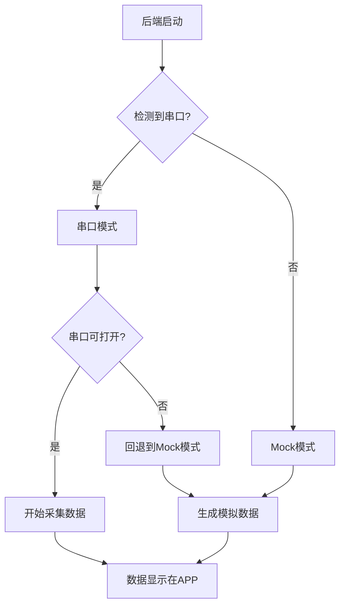

# 串口数据采集问题 - 完整解决方案

## 当前状态

✅ 后端正在运行  
✅ 设备已绑定（54:10:26:01:00:E7）  
✅ 采集目标已设置  
✅ pyserial已安装  
✅ .env配置正确  
❌ **系统运行在mock模式（模拟数据）**  
❌ **未检测到串口设备**  

## 根本原因

**USB接收器未连接或驱动未安装**

系统启动时检测不到COM3/COM4端口，自动回退到mock模式（模拟数据）。

## 解决步骤

### 步骤1：检查USB接收器

1. **确认USB接收器已插入电脑**
   - 检查USB口是否松动
   - 尝试更换USB口

2. **检查设备管理器**
   ```
   Win + X → 设备管理器 → 端口(COM和LPT)
   ```
   
   **应该看到**：
   ```
   端口(COM和LPT)
   ├─ USB-SERIAL CH340 (COM3)
   └─ USB-SERIAL CH340 (COM4)  [如果有两个接收器]
   ```
   
   **如果看到黄色感叹号**：驱动未安装或有问题

### 步骤2：安装CH340驱动（如果需要）

大多数USB串口接收器使用CH340芯片，需要安装驱动。

#### 方法1：自动安装
1. 右键设备管理器中的未知设备
2. 选择"更新驱动程序"
3. 选择"自动搜索驱动程序"

#### 方法2：手动下载
1. 下载CH340驱动：https://www.wch.cn/downloads/CH341SER_EXE.html
2. 解压并运行SETUP.EXE
3. 重启电脑

#### 方法3：使用Windows Update
```powershell
# 在PowerShell中运行
pnputil /scan-devices
```

### 步骤3：验证串口可用

```powershell
# 方法1：使用PowerShell
Get-WmiObject Win32_SerialPort | Select-Object DeviceID,Description

# 方法2：使用Python
python -c "import serial.tools.list_ports; [print(p.device, p.description) for p in serial.tools.list_ports.comports()]"
```

**应该看到**：
```
COM3 USB-SERIAL CH340 (COM3)
```

### 步骤4：修改配置（如果只有一个串口）

如果只有COM3，需要禁用双串口模式：

编辑`.env`文件：
```env
# 改为单串口模式
SERIAL_DUAL_COLLECTOR_ENABLED=false
SERIAL_PORT=COM3

# 注释掉或删除这两行
# SERIAL_BROADCAST_PORT=COM4
# SERIAL_RESPONSE_PORT=COM3
```

### 步骤5：重启后端

```bash
# 停止后端
taskkill /F /IM python.exe

# 等待3秒
timeout /t 3

# 启动后端
python run.py
```

### 步骤6：验证串口模式

等待10秒后检查：

```powershell
curl.exe http://localhost:8000/api/v1/system/info 2>$null | ConvertFrom-Json | Select-Object -ExpandProperty serial_runtime
```

**成功标志**：
```
enabled: True
runtime_mode: serial
active_target_mac: 54:10:26:01:00:E7
```

**失败标志**（需要继续排查）：
```
enabled: False
runtime_mode: mock
```

## 如果仍然是mock模式

### 检查1：查看后端日志

```bash
Get-Content backend-start.out.log -Tail 50
```

查找错误信息：
- `PermissionError`: 串口被占用
- `SerialException`: 串口不存在或无法打开
- `could not open port`: 串口配置错误

### 检查2：测试串口连接

创建测试脚本`test_serial.py`：
```python
import serial
import serial.tools.list_ports

# 列出所有串口
print("可用串口：")
for port in serial.tools.list_ports.comports():
    print(f"  {port.device}: {port.description}")

# 测试COM3
try:
    ser = serial.Serial('COM3', 115200, timeout=1)
    print("\n✓ COM3可以打开")
    ser.close()
except Exception as e:
    print(f"\n✗ COM3无法打开: {e}")
```

运行：
```bash
python test_serial.py
```

### 检查3：确认没有其他程序占用串口

可能占用串口的程序：
- Arduino IDE
- PuTTY
- Tera Term
- 串口调试助手
- 其他Python脚本
- 之前的后端实例

**解决方法**：
```bash
# 停止所有Python进程
taskkill /F /IM python.exe

# 关闭串口调试工具

# 重启后端
python run.py
```

## 临时方案：使用模拟数据

如果暂时无法解决串口问题，可以使用模拟数据测试系统：

### 当前状态
系统已经在mock模式下运行，会生成模拟的健康数据。

### 模拟数据特点
- ✅ 心率、体温、血氧等数据自动生成
- ✅ 数据符合正常范围
- ✅ 可以测试APP功能
- ❌ 不是真实手环数据

### 切换回串口模式
解决串口问题后，重启后端即可自动切换到串口模式。

## 完整诊断流程



## 快速命令汇总

```bash
# 1. 检查串口设备
Get-WmiObject Win32_SerialPort | Select-Object DeviceID,Description

# 2. 检查Python串口
python -c "import serial.tools.list_ports; [print(p.device) for p in serial.tools.list_ports.comports()]"

# 3. 重启后端
taskkill /F /IM python.exe && timeout /t 3 && python run.py

# 4. 检查运行模式
curl.exe http://localhost:8000/api/v1/system/info 2>$null | ConvertFrom-Json | Select-Object -ExpandProperty configured | Select-Object runtime_mode,data_mode,serial_mode

# 5. 查看后端日志
Get-Content backend-start.out.log -Tail 30
```

## 预期结果

### 串口模式成功
```
✓ 检测到COM3设备
✓ 串口连接成功
✓ 开始采集数据
✓ 手机APP显示实时数据
```

### Mock模式（临时方案）
```
✓ 生成模拟数据
✓ 手机APP显示模拟数据
⚠ 不是真实手环数据
```

## 下一步

1. **如果USB接收器未连接**：
   - 插入USB接收器
   - 安装驱动
   - 重启后端

2. **如果驱动未安装**：
   - 下载CH340驱动
   - 安装驱动
   - 重启电脑
   - 重启后端

3. **如果串口被占用**：
   - 关闭占用程序
   - 重启后端

4. **如果暂时无法解决**：
   - 使用当前mock模式测试系统
   - 稍后解决串口问题

## 联系支持

如果以上方法都无法解决，请提供：
1. 设备管理器截图
2. 后端日志（backend-start.out.log）
3. 串口测试结果
4. USB接收器型号

